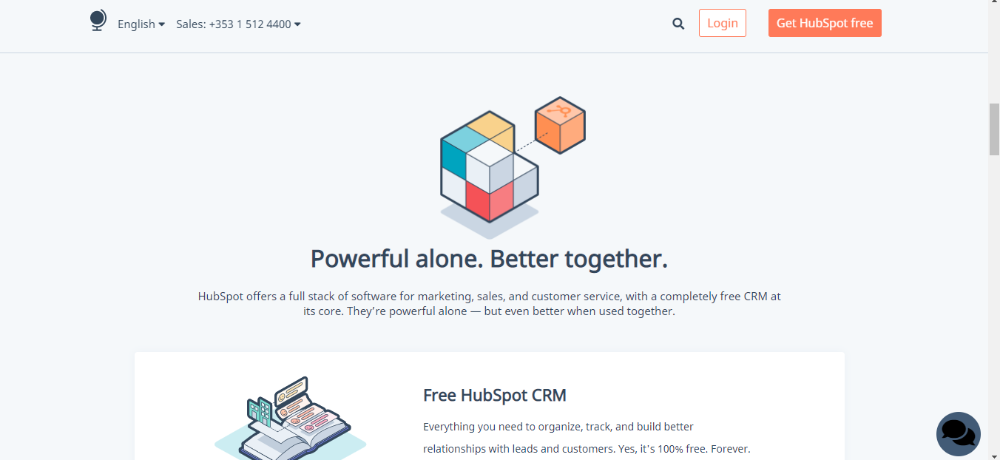

<h1> ##HubSpot</h1>

In questo progetto l'obiettivo era la creazione di una pagina web graficamente uguale a quella del sito web HubSpot.
Per la produzione sono state utilizzate le tecnologie HTML, CSS (con la possibilità di scelta nell'utilizzo di flex o Bootstrap).

<h4> Screenshot </h4>

 

 

 

 

